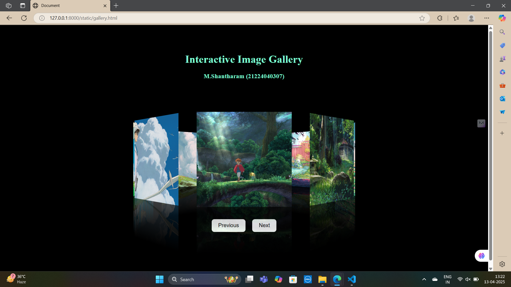

# Ex.05 Design of Interactive Image Gallery
## Date:14-04-2025

## AIM:
To design a web application for an inteactive image gallery with minimum five images.

## DESIGN STEPS:

### Step 1:
Clone the github repository and create Django admin interface.

### Step 2:
Change settings.py file to allow request from all hosts.

### Step 3:
Use CSS for positioning and styling.

### Step 4:
Write JavaScript program for implementing interactivity.

### Step 5:
Validate the HTML and CSS code.

### Step 6:
Publish the website in the given URL.

## PROGRAM :
```
<!DOCTYPE html>
<html lang="en">
<head>
    <meta charset="UTF-8">
    <meta name="viewport" content="width=device-width, initial-scale=1.0">
    <title>Document</title>
    <style>
        body{
            display: flex;
            flex-direction: column;
            justify-content: center;
            align-items: center;
            min-height: 100vh;
            background-color: black;
        }
        .box span img{
            position: absolute;
            top: 0;
            left: 0;
            width: 200px;
            height: 100%;
            object-fit: cover;
            object-position: center;
        }
        .box{
            position: relative;
            width: 200px;
            height: 200px;
            transform-style: preserve-3d;
            transition: 1.5s;
            transform: perspective(1000px) rotateY(0deg);
        }
        .box span{
            position: absolute;
            top: 0;
            left: 0;
            width: 100%;
            height: 100%;
            transform-origin: center;
            transform-style: preserve-3d;
            transform: rotateY(calc(var(--i) * 45deg)) translateZ(300px);
            -webkit-box-reflect: below 0px linear-gradient(transparent,transparent, #0004);
        }
        .controls {
            margin-top: 80px;
            display: flex;
            gap: 20px;
        }

        .controls button {
            padding: 10px 20px;
            font-size: 16px;
            background-color: white;
            border: none;
            cursor: pointer;
            border-radius: 8px;
            transition: 0.3s;
        }

        .controls button:hover {
            background-color: gray;
            color: white;
        }
        .header{
            color: aquamarine;
            margin-bottom: 120px;
            margin-top: -5%;
        }
        #playmusic{
            position: absolute;
            left: 90%;
            top: -2%;
        }
    </style>
</head>
<body>
    <div class="header">
        <h1>Interactive Image Gallery</h1>
        <center><h3>M.Shantharam (21224040307)</h3></center>
    </div>
    <div class="container">
        <div class="box" id="carousel">
            <span style="--i:0;"></span>
            <span style="--i:1;"></span>
            <span style="--i:2;"></span>
            <span style="--i:3;"></span>
            <span style="--i:4;"></span>
            <span style="--i:5;"></span>
            <span style="--i:6;"></span>
            <span style="--i:7;"></span>
        </div>
    </div>
    <div class="controls">
        <button onclick="rotateCarousel('prev')">Previous</button>
        <button onclick="rotateCarousel('next')">Next</button>
    </div>

 
    <script>
        
    let angle = 0;
    const box = document.getElementById("carousel");

    function rotateCarousel(direction) {
      if (direction === "next") {
        angle -= 45;
      } else {
        angle += 45;
      }
      box.style.transform = `perspective(1000px) rotateY(${angle}deg)`;
    }
  </script>
</body>
</html>
```
## OUTPUT:

## RESULT:
The program for designing an interactive image gallery using HTML, CSS and JavaScript is executed successfully.
